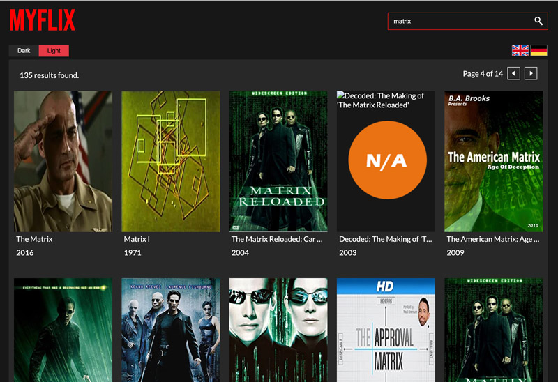

# MYFLIX

### Search for your favourite movies!

## Online working version:

http://myflix-heptagon.s3-website-us-east-1.amazonaws.com

 

## Screenshot

 

### Tech Stack

- React.js
- SASS for styling
- Redux for state management

 
This project was bootstrapped with [Create React App](https://github.com/facebook/create-react-app).
  

### `npm start`

Runs the app in the development mode.\
Open [http://localhost:3000](http://localhost:3000) to view it in the browser.

### `npm run build`

Builds the app for production to the `build` folder.\
It correctly bundles React in production mode and optimizes the build for the best performance.
See the section about [deployment](https://facebook.github.io/create-react-app/docs/deployment) for more information.
 
